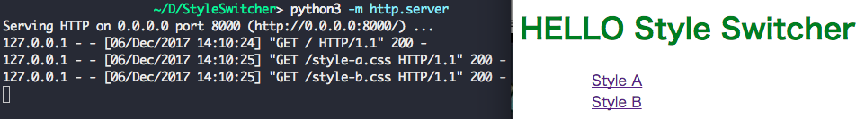

# StyleSwitcher

Run Server

```python
$ python3 -m http.server
# Open in your browser
```

## Sample



## Reference

- [CSS Style Switcher: A quick and dirty how-to](https://www.inetsolution.com/blog/march-2010/css-style-switcher-a-quick-and-dirty-how-to)
- [Alternative Style: Working With Alternate Style Sheets](https://alistapart.com/article/alternate)